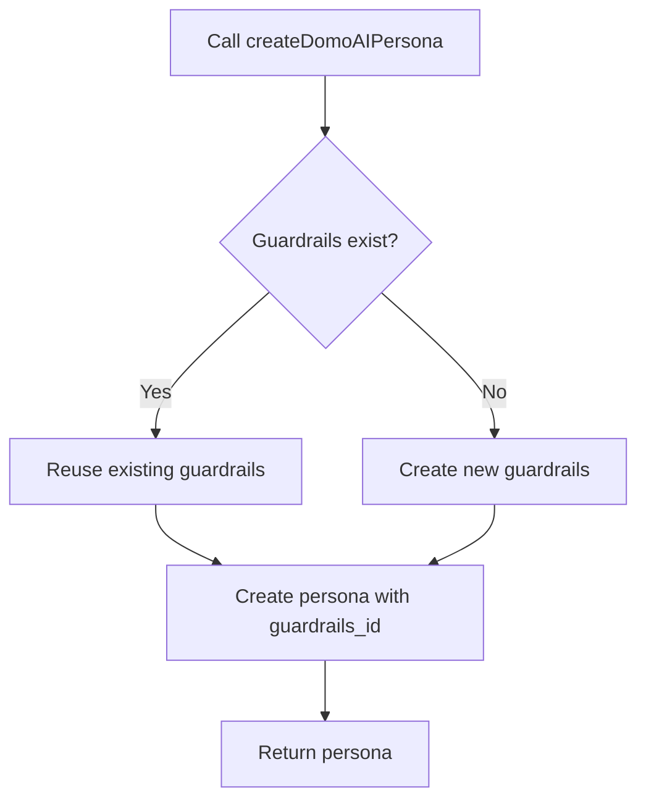

# 🛡️ Tavus Guardrails Implementation Guide

A comprehensive guide to implementing and managing Tavus guardrails in your Domo AI project.

## 📋 Table of Contents

- [Overview](#overview)
- [Quick Start](#quick-start)
- [How It Works](#how-it-works)
- [API Key Management](#api-key-management)
- [Usage Examples](#usage-examples)
- [Guardrails Reference](#guardrails-reference)
- [Troubleshooting](#troubleshooting)
- [Advanced Usage](#advanced-usage)

## 🎯 Overview

This project implements Tavus guardrails following their recommended approach:
- **Separation of Concerns**: Guardrails managed separately from system prompts
- **Reusable Templates**: Store guardrails in version-controlled templates
- **Automatic Management**: Smart creation and reuse of guardrails
- **API-First**: Use Tavus's dedicated guardrails API

### Benefits
- ✅ **Consistent Behavior**: Same rules across all personas
- ✅ **Version Control**: Track guardrails changes in your codebase
- ✅ **Easy Management**: Simple API for creating and updating
- ✅ **Automatic Reuse**: No duplicate guardrails creation

## 🚀 Quick Start

### 1. Initial Setup (One-time per API key)

```bash
# Set your Tavus API key
export TAVUS_API_KEY=your_api_key_here

# Create guardrails in Tavus
npx tsx scripts/setup-guardrails.ts
```

### 2. Create Persona with Guardrails (Automatic)

```typescript
import { createDomoAIPersona } from './src/lib/tavus/persona-with-guardrails';

// This automatically finds/creates guardrails and attaches them
const persona = await createDomoAIPersona();
console.log(`Created persona: ${persona.persona_id}`);
```

### 3. Test Everything

```bash
# Run the test suite
npx tsx src/tests/test-guardrails.ts
```

## 🔧 How It Works

### Guardrails Lifecycle



### File Structure

```
src/lib/tavus/
├── guardrails-templates.ts    # Guardrails definitions
├── guardrails-manager.ts      # API client for managing guardrails
├── persona-with-guardrails.ts # Easy persona creation
├── system_prompt_clean.md     # Clean system prompt (no guardrails)
└── README.md                  # Detailed documentation

scripts/
└── setup-guardrails.ts        # One-time setup script

examples/
└── create-persona-with-guardrails.ts  # Usage examples
```

## 🔑 API Key Management

### Same API Key (Normal Usage)
```typescript
// Everything is automatic - no setup needed
const persona = await createDomoAIPersona();
```
- **Guardrails**: Reuses existing ones
- **Personas**: Creates new persona each time
- **Setup**: No manual setup required

### New/Different API Key
```bash
# Run setup once with new API key
TAVUS_API_KEY=new-key npx tsx scripts/setup-guardrails.ts
```
- **Guardrails**: Creates new ones with new IDs
- **Personas**: Then automatic creation works
- **Setup**: One-time per API key

### Environment Variables

After setup, you can optionally set these for faster access:

```bash
# Optional: Set in your .env.local
DOMO_AI_GUARDRAILS_ID=ga478f0046ec5
DEMO_FLOW_GUARDRAILS_ID=g77b762f68956
```

## 💡 Usage Examples

### Basic Persona Creation

```typescript
import { createDomoAIPersona } from './src/lib/tavus/persona-with-guardrails';

// Automatic guardrails attachment
const persona = await createDomoAIPersona({
  // Optional: custom system prompt
  // system_prompt: "Custom instructions...",
  
  // Optional: other persona properties
  // voice_id: "your-voice-id",
  // callback_url: "https://your-webhook.com"
});

console.log(`Persona created: ${persona.persona_id}`);
```

### Add Guardrails to Existing Persona

```typescript
import { addGuardrailsToPersona } from './src/lib/tavus/persona-with-guardrails';

await addGuardrailsToPersona('existing-persona-id');
```

### Direct Guardrails Management

```typescript
import { createGuardrailsManager } from './src/lib/tavus/guardrails-manager';

const manager = createGuardrailsManager();

// List all guardrails
const allGuardrails = await manager.getAllGuardrails();
console.log(`You have ${allGuardrails.data.length} guardrails sets`);

// Get specific guardrails
const details = await manager.getGuardrails('guardrails-id');
console.log(`Guardrails: ${details.name}`);
```

### Custom Guardrails Template

```typescript
import { GuardrailTemplate } from './src/lib/tavus/guardrails-templates';

const customGuardrails: GuardrailTemplate = {
  name: "Custom Business Rules",
  data: [
    {
      guardrail_name: "No_Pricing_Discussion",
      guardrail_prompt: "Never discuss specific pricing or costs. Direct users to contact sales for pricing information.",
      modality: "verbal"
    },
    {
      guardrail_name: "Competitor_Mention_Policy",
      guardrail_prompt: "When competitors are mentioned, acknowledge them professionally but focus on our unique value propositions.",
      modality: "verbal"
    }
  ]
};

// Create custom guardrails
const manager = createGuardrailsManager();
const created = await manager.createGuardrails(customGuardrails);
```

## 📚 Guardrails Reference

### Domo AI Core Guardrails

| Guardrail | Purpose | Example Violation |
|-----------|---------|-------------------|
| **Tool_Call_Silence** | Never verbalize tool calls | "I'm calling fetch_video now..." |
| **Exact_Title_Requirement** | Only use exact video titles | Using "intro video" instead of exact title |
| **No_Content_Hallucination** | Don't invent content | Making up video titles or features |
| **Sensitive_Topics_Refusal** | Refuse inappropriate topics | Discussing politics or religion |
| **No_Parroting_Echoing** | Don't repeat user words | "You said: 'show me the demo'" |
| **Repeat_After_Me_Refusal** | Refuse "repeat after me" | User: "Say 'hello world'" |

### Demo Flow Guardrails

| Guardrail | Purpose |
|-----------|---------|
| **Progressive_Demo_Flow** | Guide users through logical sequence |
| **Knowledge_Base_First** | Always check knowledge base before answering |

## 🔍 Troubleshooting

### Common Issues

#### "TAVUS_API_KEY not found"
```bash
# Solution: Set your API key
export TAVUS_API_KEY=your_api_key_here
```

#### "Failed to create guardrails: BAD REQUEST"
- Check API key permissions
- Verify network connectivity
- Ensure guardrails template format is correct

#### "Guardrails not found"
```bash
# Solution: Run setup script
npx tsx scripts/setup-guardrails.ts
```

#### "Persona creation failed"
- Ensure guardrails are created first
- Check persona configuration
- Verify API key has persona creation permissions

### Debug Commands

```bash
# Test guardrails system
npx tsx src/tests/test-guardrails.ts

# Run examples
npx tsx examples/create-persona-with-guardrails.ts

# Check guardrails exist
curl -H "x-api-key: $TAVUS_API_KEY" https://tavusapi.com/v2/guardrails
```

### Logging

Enable debug logging:

```typescript
// In your code
console.log('Creating persona with guardrails...');
const persona = await createDomoAIPersona();
console.log('Persona created:', persona.persona_id);
```

## 🚀 Advanced Usage

### Multiple Guardrails Sets

```typescript
// Create different guardrails for different use cases
const salesGuardrails = await manager.createGuardrails(SALES_GUARDRAILS);
const supportGuardrails = await manager.createGuardrails(SUPPORT_GUARDRAILS);

// Use specific guardrails
const salesPersona = await createPersona({
  system_prompt: "You are a sales assistant...",
  guardrails_id: salesGuardrails.uuid
});
```

### Guardrails Updates

```typescript
// Update existing guardrails
const updatedTemplate = {
  ...DOMO_AI_GUARDRAILS,
  data: [
    ...DOMO_AI_GUARDRAILS.data,
    {
      guardrail_name: "New_Rule",
      guardrail_prompt: "New behavioral rule...",
      modality: "verbal"
    }
  ]
};

await manager.updateGuardrails('guardrails-id', updatedTemplate);
```

### Webhook Integration

```typescript
// Set callback URLs for guardrail violations
const guardrailsWithWebhook: GuardrailTemplate = {
  name: "Monitored Guardrails",
  data: [
    {
      guardrail_name: "Monitored_Rule",
      guardrail_prompt: "Rule with monitoring...",
      modality: "verbal",
      callback_url: "https://your-app.com/api/guardrail-webhook"
    }
  ]
};
```

### CI/CD Integration

```yaml
# .github/workflows/deploy.yml
- name: Setup Guardrails
  run: |
    export TAVUS_API_KEY=${{ secrets.TAVUS_API_KEY }}
    npx tsx scripts/setup-guardrails.ts
  env:
    TAVUS_API_KEY: ${{ secrets.TAVUS_API_KEY }}
```

## 📊 Monitoring

### Track Guardrails Usage

```typescript
import { GuardrailMonitor } from './src/lib/guardrail-monitor';

// Log violations (if using local monitoring)
GuardrailMonitor.logViolation({
  type: 'tool_verbalization',
  message: 'Agent verbalized a tool call',
  context: { conversation_id: 'conv_123' }
});

// Get violation reports
const violations = GuardrailMonitor.getViolations();
console.log(`Total violations: ${violations.length}`);
```

## 🤝 Contributing

### Adding New Guardrails

1. **Define the template** in `guardrails-templates.ts`
2. **Add to exports** in the same file
3. **Update tests** in `test-guardrails.ts`
4. **Document** the new guardrail in this README

### Testing Changes

```bash
# Run full test suite
npm test

# Test guardrails specifically
npx tsx src/tests/test-guardrails.ts

# Test with examples
npx tsx examples/create-persona-with-guardrails.ts
```

## 📞 Support

- **Issues**: Open a GitHub issue
- **Documentation**: Check `src/lib/tavus/README.md`
- **Examples**: See `examples/create-persona-with-guardrails.ts`
- **Tests**: Run `npx tsx src/tests/test-guardrails.ts`

---

**Made with ❤️ for better AI safety and consistency**