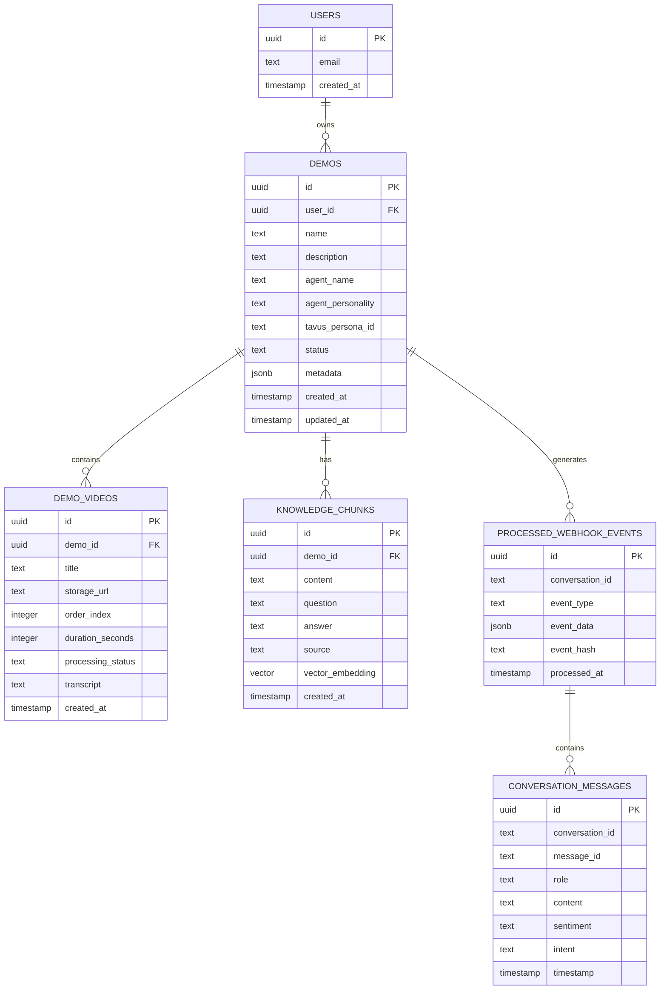

# Database Schema Documentation

This document provides comprehensive information about the database schema, relationships, and data models used in the Domo AI MVP platform.

## Overview

The platform uses PostgreSQL with Supabase as the database provider. The schema is designed to support multi-tenant demo management with AI-powered conversational video experiences.

### Key Features
- **Row Level Security (RLS)**: User data isolation and security
- **Vector Embeddings**: pgvector extension for semantic search
- **Real-time Subscriptions**: Live updates for conversation events
- **JSONB Storage**: Flexible metadata and configuration storage
- **Foreign Key Constraints**: Data integrity and referential consistency

## Core Tables

### users (Managed by Supabase Auth)

Supabase Auth automatically manages user authentication and profile data.

```sql
-- Supabase Auth users table (managed automatically)
-- Contains: id, email, encrypted_password, email_confirmed_at, etc.
```

**Key Fields:**
- `id` (UUID): Primary key, referenced by other tables as `user_id`
- `email` (TEXT): User email address
- `created_at` (TIMESTAMP): Account creation timestamp

### demos

Primary table for demo projects and configurations.

```sql
CREATE TABLE public.demos (
    id UUID PRIMARY KEY DEFAULT gen_random_uuid(),
    name TEXT NOT NULL,
    description TEXT,
    created_at TIMESTAMP WITH TIME ZONE DEFAULT NOW(),
    updated_at TIMESTAMP WITH TIME ZONE DEFAULT NOW(),
    user_id UUID NOT NULL REFERENCES auth.users(id),
    agent_name TEXT DEFAULT 'Demo Agent',
    agent_personality TEXT DEFAULT 'Friendly and helpful',
    agent_greeting TEXT DEFAULT 'Hello! I''m your demo agent. How can I help you today?',
    cta_text TEXT,
    cta_link TEXT,
    status TEXT DEFAULT 'draft',
    published_url TEXT,
    tavus_persona_id TEXT,
    tavus_conversation_id TEXT,
    video_storage_path TEXT DEFAULT '',
    metadata JSONB DEFAULT '{}'
);
```

**Key Fields:**
- `id` (UUID): Primary key for demo identification
- `user_id` (UUID): Foreign key to auth.users, enables RLS
- `tavus_persona_id` (TEXT): Links to Tavus AI persona
- `tavus_conversation_id` (TEXT): Current active conversation
- `metadata` (JSONB): Flexible storage for demo configuration

**Indexes:**
```sql
CREATE INDEX idx_demos_user_id ON public.demos(user_id);
CREATE INDEX idx_demos_status ON public.demos(status);
CREATE INDEX idx_demos_tavus_persona_id ON public.demos(tavus_persona_id);
```

**Row Level Security:**
```sql
-- Users can only access their own demos
CREATE POLICY "Users can view their own demos" ON public.demos 
FOR SELECT USING (auth.uid() = user_id);

CREATE POLICY "Users can insert their own demos" ON public.demos 
FOR INSERT WITH CHECK (auth.uid() = user_id);

CREATE POLICY "Users can update their own demos" ON public.demos 
FOR UPDATE USING (auth.uid() = user_id);

CREATE POLICY "Users can delete their own demos" ON public.demos 
FOR DELETE USING (auth.uid() = user_id);
```

### demo_videos

Stores video segments associated with demos.

```sql
CREATE TABLE public.demo_videos (
    id UUID PRIMARY KEY DEFAULT gen_random_uuid(),
    demo_id UUID NOT NULL REFERENCES public.demos(id) ON DELETE CASCADE,
    title TEXT NOT NULL,
    storage_url TEXT NOT NULL,
    order_index INTEGER NOT NULL,
    duration_seconds INTEGER,
    processing_status TEXT DEFAULT 'pending',
    created_at TIMESTAMP WITH TIME ZONE DEFAULT NOW(),
    updated_at TIMESTAMP WITH TIME ZONE DEFAULT NOW(),
    transcript TEXT
);
```

**Key Fields:**
- `demo_id` (UUID): Foreign key to demos table
- `storage_url` (TEXT): Supabase Storage URL for video file
- `order_index` (INTEGER): Display order within demo
- `processing_status` (TEXT): Transcription processing status
- `transcript` (TEXT): Generated transcript from ElevenLabs

**Indexes:**
```sql
CREATE INDEX idx_demo_videos_demo_id ON public.demo_videos(demo_id);
CREATE INDEX idx_demo_videos_order ON public.demo_videos(demo_id, order_index);
CREATE INDEX idx_demo_videos_status ON public.demo_videos(processing_status);
```

**Row Level Security:**
```sql
-- Users can only access videos from their own demos
CREATE POLICY "Users can select their demo videos" ON public.demo_videos 
FOR SELECT USING ((SELECT user_id FROM public.demos WHERE id = demo_id) = auth.uid());

CREATE POLICY "Users can insert their demo videos" ON public.demo_videos 
FOR INSERT WITH CHECK ((SELECT user_id FROM public.demos WHERE id = demo_id) = auth.uid());

CREATE POLICY "Users can update their demo videos" ON public.demo_videos 
FOR UPDATE USING ((SELECT user_id FROM public.demos WHERE id = demo_id) = auth.uid());

CREATE POLICY "Users can delete their demo videos" ON public.demo_videos 
FOR DELETE USING ((SELECT user_id FROM public.demos WHERE id = demo_id) = auth.uid());
```

### knowledge_chunks

Stores knowledge base content with vector embeddings for semantic search.

```sql
CREATE TABLE public.knowledge_chunks (
    id UUID PRIMARY KEY DEFAULT gen_random_uuid(),
    demo_id UUID NOT NULL REFERENCES public.demos(id) ON DELETE CASCADE,
    content TEXT NOT NULL,
    question TEXT,
    answer TEXT,
    source TEXT,
    vector_embedding vector(1536),
    created_at TIMESTAMP WITH TIME ZONE DEFAULT NOW(),
    updated_at TIMESTAMP WITH TIME ZONE DEFAULT NOW()
);
```

**Key Fields:**
- `demo_id` (UUID): Foreign key to demos table
- `content` (TEXT): Main text content for embedding
- `question` (TEXT): Optional Q&A pair question
- `answer` (TEXT): Optional Q&A pair answer
- `source` (TEXT): Content source (e.g., "Video: Product Demo")
- `vector_embedding` (vector(1536)): OpenAI embedding for semantic search

**Indexes:**
```sql
CREATE INDEX idx_knowledge_chunks_demo_id ON public.knowledge_chunks(demo_id);
CREATE INDEX knowledge_chunks_vector_embedding_idx ON public.knowledge_chunks 
USING ivfflat (vector_embedding vector_cosine_ops) WITH (lists = 100);
```

**Row Level Security:**
```sql
-- Users can only access knowledge chunks from their own demos
CREATE POLICY "Users can select their knowledge chunks" ON public.knowledge_chunks 
FOR SELECT USING ((SELECT user_id FROM public.demos WHERE id = demo_id) = auth.uid());

CREATE POLICY "Users can insert their knowledge chunks" ON public.knowledge_chunks 
FOR INSERT WITH CHECK ((SELECT user_id FROM public.demos WHERE id = demo_id) = auth.uid());

CREATE POLICY "Users can update their knowledge chunks" ON public.knowledge_chunks 
FOR UPDATE USING ((SELECT user_id FROM public.demos WHERE id = demo_id) = auth.uid());

CREATE POLICY "Users can delete their knowledge chunks" ON public.knowledge_chunks 
FOR DELETE USING ((SELECT user_id FROM public.demos WHERE id = demo_id) = auth.uid());
```

## Analytics and Event Tables

### processed_webhook_events

Stores webhook events for analytics and real-time processing.

```sql
CREATE TABLE public.processed_webhook_events (
    id UUID PRIMARY KEY DEFAULT gen_random_uuid(),
    conversation_id TEXT NOT NULL,
    event_type TEXT NOT NULL,
    event_data JSONB NOT NULL,
    processed_at TIMESTAMP WITH TIME ZONE DEFAULT NOW(),
    processing_duration_ms INTEGER,
    event_hash TEXT UNIQUE -- For idempotency
);
```

**Key Fields:**
- `conversation_id` (TEXT): Links to Tavus conversation
- `event_type` (TEXT): Type of webhook event
- `event_data` (JSONB): Full event payload
- `event_hash` (TEXT): SHA256 hash for deduplication

**Indexes:**
```sql
CREATE INDEX idx_webhook_events_conversation_id ON public.processed_webhook_events(conversation_id);
CREATE INDEX idx_webhook_events_type ON public.processed_webhook_events(event_type);
CREATE INDEX idx_webhook_events_processed_at ON public.processed_webhook_events(processed_at);
CREATE UNIQUE INDEX idx_webhook_events_hash ON public.processed_webhook_events(event_hash);
```

### conversation_messages

Stores individual conversation messages for analytics.

```sql
CREATE TABLE public.conversation_messages (
    id UUID PRIMARY KEY DEFAULT gen_random_uuid(),
    conversation_id TEXT NOT NULL,
    message_id TEXT,
    role TEXT NOT NULL, -- 'user' or 'assistant'
    content TEXT,
    content_length INTEGER,
    timestamp TIMESTAMP WITH TIME ZONE,
    sentiment TEXT,
    intent TEXT,
    confidence DECIMAL(3,2),
    created_at TIMESTAMP WITH TIME ZONE DEFAULT NOW()
);
```

**Indexes:**
```sql
CREATE INDEX idx_conversation_messages_conversation_id ON public.conversation_messages(conversation_id);
CREATE INDEX idx_conversation_messages_timestamp ON public.conversation_messages(timestamp);
CREATE INDEX idx_conversation_messages_role ON public.conversation_messages(role);
```

## Storage Configuration

### Supabase Storage Buckets

```sql
-- Demo videos bucket
INSERT INTO storage.buckets (id, name, public, file_size_limit)
VALUES ('demo-videos', 'demo-videos', false, 104857600) -- 100MB limit
ON CONFLICT (id) DO NOTHING;
```

### Storage Policies

```sql
-- Users can only access videos from their own demos
CREATE POLICY "Users can view their own videos" ON storage.objects 
FOR SELECT USING (
    bucket_id = 'demo-videos' AND 
    (storage.foldername(name))[1] IN (
        SELECT id::text FROM public.demos WHERE user_id = auth.uid()
    )
);

CREATE POLICY "Users can upload their own videos" ON storage.objects 
FOR INSERT WITH CHECK (
    bucket_id = 'demo-videos' AND 
    (storage.foldername(name))[1] IN (
        SELECT id::text FROM public.demos WHERE user_id = auth.uid()
    )
);

CREATE POLICY "Users can update their own videos" ON storage.objects 
FOR UPDATE USING (
    bucket_id = 'demo-videos' AND 
    (storage.foldername(name))[1] IN (
        SELECT id::text FROM public.demos WHERE user_id = auth.uid()
    )
);

CREATE POLICY "Users can delete their own videos" ON storage.objects 
FOR DELETE USING (
    bucket_id = 'demo-videos' AND 
    (storage.foldername(name))[1] IN (
        SELECT id::text FROM public.demos WHERE user_id = auth.uid()
    )
);
```

## Entity Relationships

### Primary Relationships



### Data Flow Relationships

1. **User → Demo**: Users create and own multiple demos
2. **Demo → Videos**: Each demo contains multiple video segments
3. **Demo → Knowledge**: Each demo has a knowledge base with embeddings
4. **Demo → Conversations**: Demos generate Tavus conversations
5. **Conversations → Events**: Conversations generate webhook events
6. **Events → Messages**: Events contain conversation messages

## Database Functions

### Vector Similarity Search

```sql
-- Function for semantic search in knowledge base
CREATE OR REPLACE FUNCTION search_knowledge_chunks(
    query_embedding vector(1536),
    demo_id uuid,
    match_threshold float DEFAULT 0.7,
    match_count int DEFAULT 5
)
RETURNS TABLE (
    id uuid,
    content text,
    question text,
    answer text,
    source text,
    similarity float
)
LANGUAGE sql
AS $$
    SELECT
        id,
        content,
        question,
        answer,
        source,
        1 - (vector_embedding <=> query_embedding) AS similarity
    FROM knowledge_chunks
    WHERE 
        knowledge_chunks.demo_id = search_knowledge_chunks.demo_id
        AND 1 - (vector_embedding <=> query_embedding) > match_threshold
    ORDER BY vector_embedding <=> query_embedding
    LIMIT match_count;
$$;
```

### Demo Statistics

```sql
-- Function to get demo statistics
CREATE OR REPLACE FUNCTION get_demo_stats(demo_uuid uuid)
RETURNS TABLE (
    video_count bigint,
    knowledge_chunk_count bigint,
    total_video_duration integer,
    last_conversation_at timestamp with time zone
)
LANGUAGE sql
AS $$
    SELECT
        (SELECT COUNT(*) FROM demo_videos WHERE demo_id = demo_uuid) as video_count,
        (SELECT COUNT(*) FROM knowledge_chunks WHERE demo_id = demo_uuid) as knowledge_chunk_count,
        (SELECT COALESCE(SUM(duration_seconds), 0) FROM demo_videos WHERE demo_id = demo_uuid) as total_video_duration,
        (SELECT MAX(processed_at) FROM processed_webhook_events 
         WHERE event_data->>'demo_id' = demo_uuid::text) as last_conversation_at;
$$;
```

## Data Types and Constraints

### Custom Types

```sql
-- Demo status enumeration
CREATE TYPE demo_status AS ENUM ('draft', 'published', 'archived');

-- Video processing status
CREATE TYPE processing_status AS ENUM ('pending', 'processing', 'completed', 'failed');

-- Message roles
CREATE TYPE message_role AS ENUM ('user', 'assistant', 'system');
```

### Constraints

```sql
-- Demo constraints
ALTER TABLE demos ADD CONSTRAINT demos_status_check 
CHECK (status IN ('draft', 'published', 'archived'));

ALTER TABLE demos ADD CONSTRAINT demos_name_length_check 
CHECK (char_length(name) >= 1 AND char_length(name) <= 255);

-- Video constraints
ALTER TABLE demo_videos ADD CONSTRAINT demo_videos_order_index_check 
CHECK (order_index >= 0);

ALTER TABLE demo_videos ADD CONSTRAINT demo_videos_duration_check 
CHECK (duration_seconds IS NULL OR duration_seconds > 0);

-- Knowledge chunk constraints
ALTER TABLE knowledge_chunks ADD CONSTRAINT knowledge_chunks_content_length_check 
CHECK (char_length(content) >= 1);
```

## Triggers and Automation

### Updated At Triggers

```sql
-- Function to update updated_at timestamp
CREATE OR REPLACE FUNCTION update_updated_at_column()
RETURNS TRIGGER AS $$
BEGIN
    NEW.updated_at = NOW();
    RETURN NEW;
END;
$$ language 'plpgsql';

-- Apply to relevant tables
CREATE TRIGGER update_demos_updated_at 
    BEFORE UPDATE ON demos 
    FOR EACH ROW EXECUTE FUNCTION update_updated_at_column();

CREATE TRIGGER update_demo_videos_updated_at 
    BEFORE UPDATE ON demo_videos 
    FOR EACH ROW EXECUTE FUNCTION update_updated_at_column();

CREATE TRIGGER update_knowledge_chunks_updated_at 
    BEFORE UPDATE ON knowledge_chunks 
    FOR EACH ROW EXECUTE FUNCTION update_updated_at_column();
```

### Real-time Subscriptions

```sql
-- Enable real-time for demos table
ALTER PUBLICATION supabase_realtime ADD TABLE public.demos;
ALTER PUBLICATION supabase_realtime ADD TABLE public.processed_webhook_events;
```

## Migration Strategy

### Version Control

All schema changes are managed through Supabase migrations:

```bash
# Create new migration
supabase migration new add_new_feature

# Apply migrations
supabase migration up

# Reset database (development only)
supabase db reset
```

### Migration Files

Located in `supabase/migrations/` with timestamp prefixes:

- `20241210000000_add_conversation_details.sql`
- `20241213000001_add_custom_objectives.sql`
- `20250725063500_create_missing_tables.sql`

### Backward Compatibility

- Use `IF NOT EXISTS` for table creation
- Add columns with `ADD COLUMN IF NOT EXISTS`
- Drop policies before recreating
- Handle existing data gracefully

## Performance Optimization

### Indexing Strategy

```sql
-- Composite indexes for common queries
CREATE INDEX idx_demos_user_status ON public.demos(user_id, status);
CREATE INDEX idx_videos_demo_order ON public.demo_videos(demo_id, order_index);
CREATE INDEX idx_chunks_demo_source ON public.knowledge_chunks(demo_id, source);

-- Partial indexes for specific conditions
CREATE INDEX idx_videos_processing ON public.demo_videos(demo_id) 
WHERE processing_status = 'pending';

-- Expression indexes for JSONB queries
CREATE INDEX idx_demos_metadata_gin ON public.demos USING gin(metadata);
```

### Query Optimization

```sql
-- Optimized query for demo dashboard
SELECT 
    d.*,
    COUNT(dv.id) as video_count,
    COUNT(kc.id) as knowledge_count,
    MAX(pwe.processed_at) as last_activity
FROM demos d
LEFT JOIN demo_videos dv ON d.id = dv.demo_id
LEFT JOIN knowledge_chunks kc ON d.id = kc.demo_id
LEFT JOIN processed_webhook_events pwe ON pwe.event_data->>'demo_id' = d.id::text
WHERE d.user_id = $1
GROUP BY d.id
ORDER BY d.updated_at DESC;
```

### Connection Pooling

Supabase provides automatic connection pooling:

- **Transaction mode**: For short-lived transactions
- **Session mode**: For longer connections
- **Statement mode**: For single queries

## Security Considerations

### Row Level Security (RLS)

All user data is protected by RLS policies:

```sql
-- Enable RLS on all tables
ALTER TABLE public.demos ENABLE ROW LEVEL SECURITY;
ALTER TABLE public.demo_videos ENABLE ROW LEVEL SECURITY;
ALTER TABLE public.knowledge_chunks ENABLE ROW LEVEL SECURITY;
```

### Data Encryption

- **At Rest**: Supabase encrypts all data at rest
- **In Transit**: All connections use TLS/SSL
- **Application Level**: Sensitive fields can be encrypted before storage

### Audit Logging

```sql
-- Audit log table for sensitive operations
CREATE TABLE public.audit_logs (
    id UUID PRIMARY KEY DEFAULT gen_random_uuid(),
    user_id UUID REFERENCES auth.users(id),
    action TEXT NOT NULL,
    table_name TEXT NOT NULL,
    record_id UUID,
    old_values JSONB,
    new_values JSONB,
    created_at TIMESTAMP WITH TIME ZONE DEFAULT NOW()
);
```

## Backup and Recovery

### Automated Backups

Supabase provides:
- **Daily backups** for 7 days (free tier)
- **Point-in-time recovery** (paid tiers)
- **Manual backup** via pg_dump

### Data Export

```sql
-- Export demo data for user
SELECT 
    d.*,
    json_agg(DISTINCT dv.*) as videos,
    json_agg(DISTINCT kc.*) as knowledge_chunks
FROM demos d
LEFT JOIN demo_videos dv ON d.id = dv.demo_id
LEFT JOIN knowledge_chunks kc ON d.id = kc.demo_id
WHERE d.user_id = $1
GROUP BY d.id;
```

## Monitoring and Maintenance

### Database Health Checks

```sql
-- Check table sizes
SELECT 
    schemaname,
    tablename,
    pg_size_pretty(pg_total_relation_size(schemaname||'.'||tablename)) as size
FROM pg_tables 
WHERE schemaname = 'public'
ORDER BY pg_total_relation_size(schemaname||'.'||tablename) DESC;

-- Check index usage
SELECT 
    indexrelname,
    idx_tup_read,
    idx_tup_fetch,
    idx_scan
FROM pg_stat_user_indexes
ORDER BY idx_scan DESC;
```

### Performance Monitoring

```sql
-- Slow query analysis
SELECT 
    query,
    calls,
    total_time,
    mean_time,
    rows
FROM pg_stat_statements
ORDER BY mean_time DESC
LIMIT 10;
```

This comprehensive database schema documentation covers all aspects of data storage and management in the Domo AI MVP platform. For specific implementation details, refer to the migration files in `supabase/migrations/` and the service layer code in `src/lib/services/`.